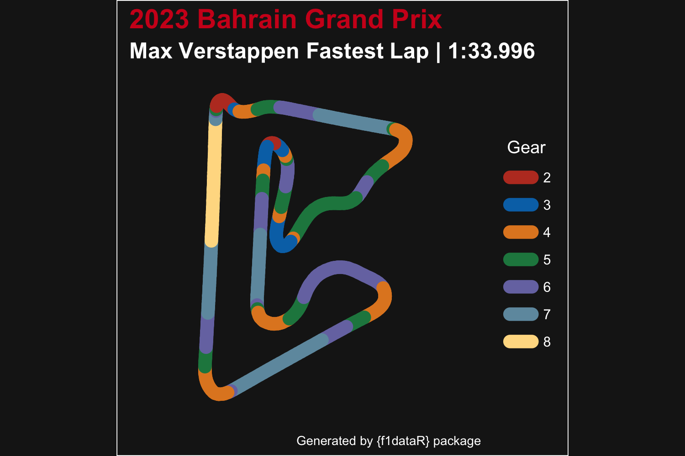

# f1dataR 

An R package to access Formula 1 Data from the Ergast API and the
official F1 data stream via the FastF1 Python library.

<!-- badges: start -->

[](https://github.com/SCasanova/f1dataR/actions/workflows/check-standard.yaml)
[](https://github.com/SCasanova/f1dataR/actions/workflows/test-coverage.yaml)
[](https://app.codecov.io/gh/SCasanova/f1dataR?branch=main)
[](https://lifecycle.r-lib.org/articles/stages.html#stable)
[](https://CRAN.R-project.org/package=f1dataR)
[](https://CRAN.R-project.org/package=f1dataR)
<!--badges: end -->

## Installation

Install the stable version from CRAN:

``` r
install.packages("f1dataR")
```

or install the development version from GitHub:

``` r
if (!require("remotes")) install.packages("remotes")
remotes::install_github("SCasanova/f1dataR")
library(f1dataR)
```

## Data Sources

Data is pulled from:

- [Ergast API](https://ergast.com/mrd/)
- [F1 Data Stream](https://www.formula1.com/en/f1-live.html) via the
  [Fast F1 python library](https://docs.fastf1.dev/index.html)

Note the Ergast Motor Racing Database API will be shutting down at the
end of 2024. When a new data source is identified the package will be
migrated to that source.

## Functions

### Load Lap Times

> `load_laps(season = "current", race = "last")`

This function loads lap-by-lap time data for all drivers in a given
season and round. Round refers to race number. The defaults are current
season and last race. Lap data is limited to 1996-present.

**Example:**

``` r
load_laps()
#> # A tibble: 1,157 × 6
#>    driver_id      position time       lap time_sec season
#>    <chr>          <chr>    <chr>    <int>    <dbl>  <dbl>
#>  1 max_verstappen 1        1:32.190     1     92.2   2023
#>  2 leclerc        2        1:33.119     1     93.1   2023
#>  3 piastri        3        1:33.882     1     93.9   2023
#>  4 norris         4        1:34.309     1     94.3   2023
#>  5 russell        5        1:34.776     1     94.8   2023
#>  6 tsunoda        6        1:35.435     1     95.4   2023
#>  7 alonso         7        1:36.044     1     96.0   2023
#>  8 gasly          8        1:36.636     1     96.6   2023
#>  9 hamilton       9        1:37.227     1     97.2   2023
#> 10 perez          10       1:37.745     1     97.7   2023
#> # ℹ 1,147 more rows
```

or

``` r
load_laps(season = 2021, round = 15)
#> # A tibble: 1,025 × 6
#>    driver_id position time       lap time_sec season
#>    <chr>     <chr>    <chr>    <int>    <dbl>  <dbl>
#>  1 sainz     1        1:42.997     1     103.   2021
#>  2 norris    2        1:44.272     1     104.   2021
#>  3 russell   3        1:46.318     1     106.   2021
#>  4 stroll    4        1:47.279     1     107.   2021
#>  5 ricciardo 5        1:48.221     1     108.   2021
#>  6 alonso    6        1:49.347     1     109.   2021
#>  7 hamilton  7        1:49.826     1     110.   2021
#>  8 perez     8        1:50.617     1     111.   2021
#>  9 ocon      9        1:51.098     1     111.   2021
#> 10 raikkonen 10       1:51.778     1     112.   2021
#> # ℹ 1,015 more rows
```

### Driver Telemetry

> `load_driver_telemetry(season = "current", race = "last", session = "R", driver, laps = "all")`

When the parameters for season (four digit year), round (number or GP
name), session (FP1. FP2, FP3, Q, S, SS, or R), and driver code (three
letter code) are entered, the function will load all data for a session
and the pull the info for the selected driver. The first time a session
is called, loading times will be relatively long but in subsequent calls
this will improve to only a couple of seconds

``` r
load_driver_telemetry(season = 2022, round = 4, driver = "PER")
#> # A tibble: 592 × 19
#>    date                session_time  time   rpm speed n_gear throttle brake
#>    <dttm>                     <dbl> <dbl> <dbl> <dbl>  <dbl>    <dbl> <lgl>
#>  1 2022-04-24 14:19:27        8308. 0     11221   282      7      100 FALSE
#>  2 2022-04-24 14:19:27        8308. 0.021 11221   283      7      100 FALSE
#>  3 2022-04-24 14:19:28        8308. 0.278 11221   284      7      100 FALSE
#>  4 2022-04-24 14:19:28        8308. 0.401 11279   285      7      100 FALSE
#>  5 2022-04-24 14:19:28        8309. 0.678 11337   286      7      100 FALSE
#>  6 2022-04-24 14:19:28        8309. 0.681 11376   287      7      100 FALSE
#>  7 2022-04-24 14:19:28        8309. 0.86  11416   288      7      100 FALSE
#>  8 2022-04-24 14:19:29        8309. 1.08  11456   289      7      100 FALSE
#>  9 2022-04-24 14:19:29        8309. 1.18  11461   289      7      100 FALSE
#> 10 2022-04-24 14:19:29        8309. 1.24  11467   290      7      100 FALSE
#> # ℹ 582 more rows
#> # ℹ 11 more variables: drs <dbl>, source <chr>, relative_distance <dbl>,
#> #   status <chr>, x <dbl>, y <dbl>, z <dbl>, distance <dbl>,
#> #   driver_ahead <chr>, distance_to_driver_ahead <dbl>, …

load_driver_telemetry(season = 2018, round = 7, "Q", "HAM", laps = "fastest")
#> # A tibble: 534 × 19
#>    date                session_time  time   rpm speed n_gear throttle brake
#>    <dttm>                     <dbl> <dbl> <dbl> <dbl>  <dbl>    <dbl> <lgl>
#>  1 2018-06-09 18:59:18        3788. 0     10674   297      8      100 FALSE
#>  2 2018-06-09 18:59:18        3788. 0.016 10704   298      8      100 FALSE
#>  3 2018-06-09 18:59:18        3788. 0.043 10762   299      8      100 FALSE
#>  4 2018-06-09 18:59:19        3788. 0.256 10820   301      8      100 FALSE
#>  5 2018-06-09 18:59:19        3788. 0.343 10847   302      8      100 FALSE
#>  6 2018-06-09 18:59:19        3788. 0.496 10875   303      8      100 FALSE
#>  7 2018-06-09 18:59:19        3789. 0.643 10921   303      8      100 FALSE
#>  8 2018-06-09 18:59:19        3789. 0.736 10967   304      8      100 FALSE
#>  9 2018-06-09 18:59:19        3789. 0.943 10990   305      8      100 FALSE
#> 10 2018-06-09 18:59:19        3789. 0.976 11014   306      8      100 FALSE
#> # ℹ 524 more rows
#> # ℹ 11 more variables: drs <dbl>, source <chr>, relative_distance <dbl>,
#> #   status <chr>, x <dbl>, y <dbl>, z <dbl>, distance <dbl>,
#> #   driver_ahead <chr>, distance_to_driver_ahead <dbl>, …
```

### Lap-by-Lap information

> `load_session_laps(season = "current", race = "last", session = "R", add_weather = FALSE)`

This function will give us detailed information of lap and sector times,
tyres, weather (optional), and more for every lap of the GP and driver.

``` r
load_session_laps(season = 2023, round = 4, add_weather = TRUE)
#> # A tibble: 962 × 39
#>     time driver driver_number lap_time lap_number stint pit_out_time pit_in_time
#>    <dbl> <chr>  <chr>            <dbl>      <dbl> <dbl>        <dbl>       <dbl>
#>  1 3892. VER    1                 110.          1     1          NaN        NaN 
#>  2 4000. VER    1                 108.          2     1          NaN        NaN 
#>  3 4108. VER    1                 108.          3     1          NaN        NaN 
#>  4 4215. VER    1                 107.          4     1          NaN        NaN 
#>  5 4322. VER    1                 107.          5     1          NaN        NaN 
#>  6 4430. VER    1                 107.          6     1          NaN        NaN 
#>  7 4537. VER    1                 107.          7     1          NaN        NaN 
#>  8 4643. VER    1                 107.          8     1          NaN        NaN 
#>  9 4750. VER    1                 107.          9     1          NaN        NaN 
#> 10 4861. VER    1                 111.         10     1          NaN       4860.
#> # ℹ 952 more rows
#> # ℹ 31 more variables: sector1time <dbl>, sector2time <dbl>, sector3time <dbl>,
#> #   sector1session_time <dbl>, sector2session_time <dbl>,
#> #   sector3session_time <dbl>, speed_i1 <dbl>, speed_i2 <dbl>, speed_fl <dbl>,
#> #   speed_st <dbl>, …
```

### Circuit Data

> `load_circuit_details(2023, 4)`

This function loads circuit details for a specific race session. Note
that different track layouts are used at some circuits depending on the
year of the race. Useful for visualizing or annotating data. Contains
information on corners, marshal_lights and marshal_sectors.

### Plotting

> `plot_fastest(season = "current", round = "last", session = "R", driver, color = "gear")`

A built in plotting function that plots the circuit and a driver’s
fastest laps’ `speed` or `gear` exists.

``` r
plot_fastest(season = 2023, round = 1, session = "R", driver = "VER", color = "gear")
```



Two helper functions exist as well. The first, `theme_dark_f1()` assists
with colour schemes similar to that used in other F1 graphics. The
second, `correct_track_ratio()` is a function that fixes track ratio
issues that appear when you create images similar to that above from
`plot_fastest()`. Please refer to their documentation for usage.

### Cache information

The cache directory for sessions can be set manually with the options
function

``` r
options(f1dataR.cache = "path/to/directory")
```

### Other functions

Many other functions exist, and are flexible enough to call the current
`season` with the string `"current"` or use the year as a numeric value.
Similarly, `round` can be `"last"` or a round number (from 1 to the
total number of races in a season).

- `load_constructors()`
- `load_drivers(season = "current")`
- `load_circuits(season = "current")`
- `load_pitstops(season = "current", round = "last")`
- `load_quali(season = "current", round = "last")`
- `load_results(season = "current", round = "last")`
- `load_schedule(season =`2023`)`
- `load_sprint(season = "current", round = "last")`
- `load_standings(season = "current", round = "last", type = c("driver", "constructor"))`

### Clear F1 Cache

> `clear_f1_cache()`

Clears the cache for all functions in the package.

## Loaded Data

The package also includes a static data frame for all current
Constructors. Complete with team colors, and links to team logos.

``` r
constructor_data %>% colnames()
#> [1] "constructor_id"     "constructor_color"  "constructor_color2"
#> [4] "constructor_logo"
```
