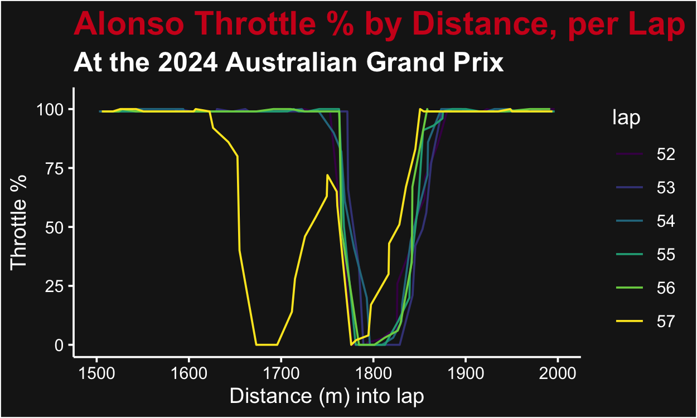
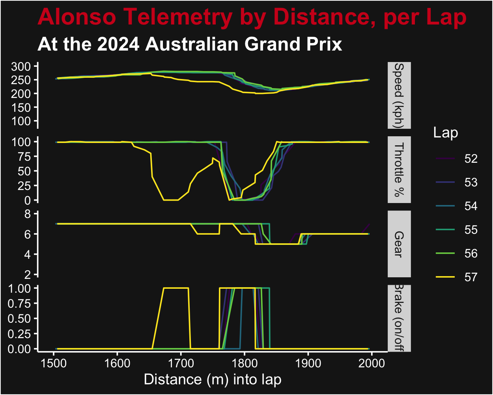
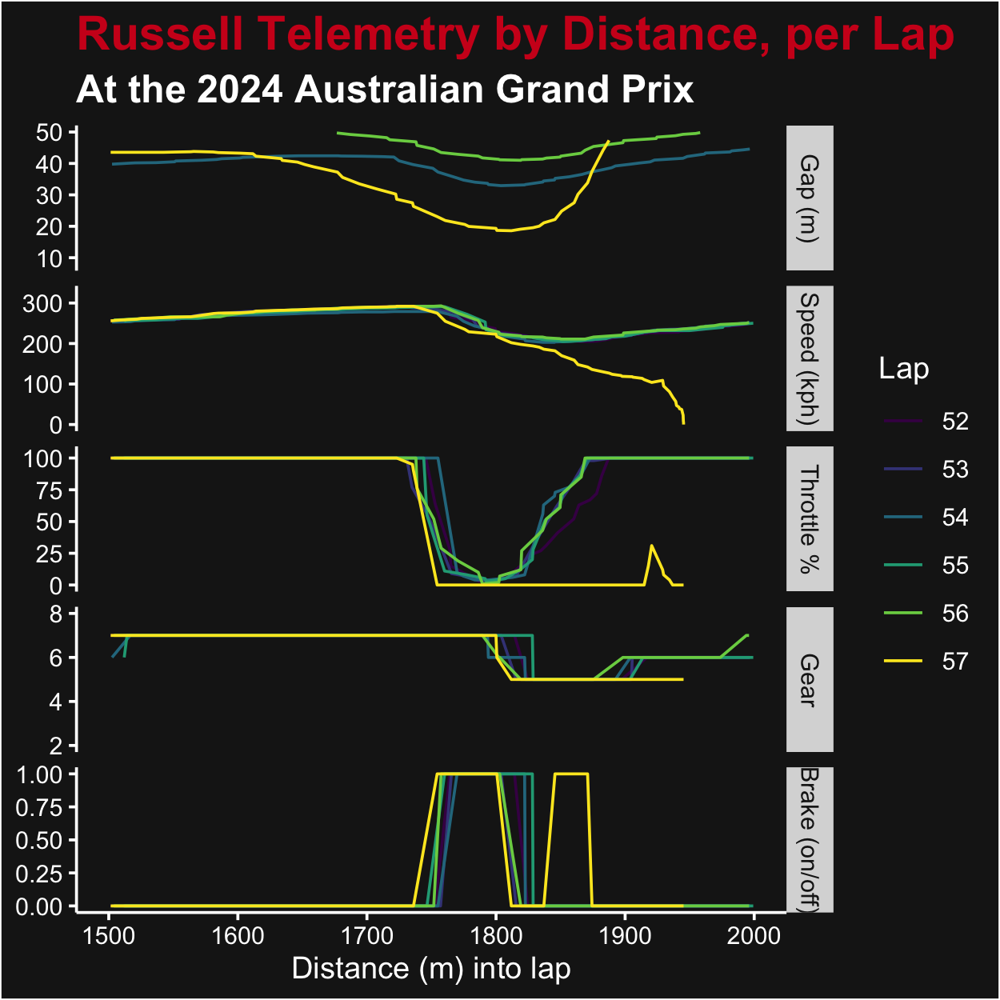

In the closing laps of the 2024 Australian Grand Prix, the lone remaining Mercedes of George Russell was in a showdown with Aston Martin's Fernando Alonso. On the penultimate lap, Russell crashed out at turn 6-7, coming to a stop at an awkward angle skew across the track. Following the race, both drivers were called to the Stewards, who discussed the incident with both drivers and reviewed data and video. They handed Alonso a 20 second penalty for causing the crash, despite there not having been any contact between the two drivers. A large portion of the decision rested on the telemetry from the drivers' cars. While the Stewards, FIA and Teams have much more detailed data than we do, we can repeat their analysis using R, `f1dataR` and the Python FastF1 package. 

# Accessing the Data
We'll start by loading the `f1dataR` package, and preparing the Python virtual environment (including installing FastF1). This happens automatically with a call to `setup_fastf1()`, [see the setup_fastf1 vignette](setup_fastf1.Rmd) for more information.


```r
library(f1dataR)
setup_fastf1()
```

Since the crash occurred on lap 57, we'll download telemetry for Alonso for the five previous laps to compare what Alonso did on the fateful lap compared to those before. We'll also load Russell's telemetry from lap 57 to see how he reacts before the crash. Note we use some `dplyr` for data manipulation.


```r
alo_telem <- dplyr::bind_rows(lapply(c(52:57), function(l) load_driver_telemetry(season = 2024, round = "Australia", session = "R", driver = "ALO", laps = l) %>% dplyr::mutate(lap = l)))
rus_telem <- dplyr::bind_rows(lapply(c(52:57), function(l) load_driver_telemetry(season = 2024, round = "Australia", session = "R", driver = "RUS", laps = l) %>% dplyr::mutate(lap = l)))
```
A few manipulations now will make later plotting easier:

```r
alo_telem$lap <- as.factor(alo_telem$lap)
alo_telem$brake <- as.integer(alo_telem$brake)
rus_telem$lap <- as.factor(rus_telem$lap)
rus_telem$brake <- as.integer(rus_telem$brake)
```
# Telemetry Review
Alonso stated he had some challenges with his car (specifically the ERS deployment system, according to an interview he did with Sky Sports as reported on [f1.com](https://www.formula1.com/en/latest/article/russell-and-alonso-offer-opposing-views-on-incident-that-led-to-crash-in.5mMIZKgJmq5uJTNXp5W4uk)). But if we look at the telemetry from Alonso comparing lap 57 to the previous, we see the following (focusing on the T6-7 area from 1500 to 2000 m into the lap):


```r
ggplot2::ggplot(alo_telem, ggplot2::aes(x = distance, y = throttle, color = lap)) + 
  ggplot2::geom_path() + 
  ggplot2::scale_color_viridis_d() + 
  f1dataR::theme_dark_f1(axis_marks = T) + 
  ggplot2::ggtitle("Alonso Throttle % by Distance, per Lap", subtitle = "At the 2024 Australian Grand Prix") +
  ggplot2::xlab("Distance (m) into lap") +
  ggplot2::ylab("Throttle %")+
  ggplot2::xlim(c(1500, 2000))
#> Warning: Removed 3489 rows containing missing values (`geom_path()`).
```

<div class="figure">

<p class="caption">Throttle Percent by Distance, per lap, for Fernando Alonso at the 2024 Australian GP</p>
</div>

In this plot we can see that he let off the throttle starting about 180 m before any other lap, and had to put some throttle back on before the normal braking point. This doesn't line up with someone suffering from ERS deployment, but instead an intentional effort to drive the car differently then in the previous laps. 

Similarly, we can look at braking (on/off), selected gear, and speed traces to see all the differences:


```r
long_telem_alo <- alo_telem %>% 
  dplyr::select(c("speed", "n_gear", "throttle", "brake", "lap", "distance")) %>% 
  tidyr::pivot_longer(cols = c("speed", "n_gear", "throttle", "brake"), 
                      names_to = "param", 
                      values_to = "value") %>%
  dplyr::mutate(param = dplyr::case_match(param, 
                                          "speed" ~ "Speed (kph)", 
                                          "n_gear" ~ "Gear",
                                          "throttle" ~ "Throttle %",
                                          "brake" ~ "Brake (on/off)")) %>%
  dplyr::rename("Lap" = "lap") %>%
  dplyr::mutate(param = factor(param, c("Speed (kph)", "Throttle %", "Gear", "Brake (on/off)")))

ggplot2::ggplot(long_telem_alo, ggplot2::aes(x = distance, y = value, color = Lap)) + 
  ggplot2::geom_path() + 
  ggplot2::scale_color_viridis_d() + 
  f1dataR::theme_dark_f1(axis_marks = T) + 
  ggplot2::facet_grid(rows = ggplot2::vars(param), scales = "free") +
  ggplot2::ggtitle("Alonso Telemetry by Distance, per Lap", subtitle = "At the 2024 Australian Grand Prix") +
  ggplot2::xlab("Distance (m) into lap") +
  ggplot2::ylab(NULL)+
  ggplot2::xlim(c(1500, 2000))
#> Warning: Removed 13956 rows containing missing values (`geom_path()`).
```

<div class="figure">

<p class="caption">Telemetry (Speed, Throttle, Gear, Brake) by Distance, per lap, for Fernando Alonso at the 2024 Australian GP</p>
</div>

Alonso at the Stewards visit claimed intent to drive a different line at T6 (Stewards document, reported on [f1.com](https://www.formula1.com/en/latest/article/breaking-alonso-hit-with-post-race-time-penalty-in-australia-over.4h6Fl1W2KOlvkG4UybDXs6)). This aligns better with the telemetry, there are multiple actions going on (reduction of throttle, application of brake, downshift) that indicate that the reduction of speed was intentional (and poorly timed, he had to accelerate a bit to get into the corner). 

# Effect on Russell

Russell, of course, was tailing Alonso, and the telemetry provides a (calculated) distance behind the driver in front. We can observe this (with his other telemetry lines too).


```r
long_telem_rus <- rus_telem %>% 
  dplyr::select(c("speed", "n_gear", "throttle", "brake", "lap", "distance", "distance_to_driver_ahead")) %>% 
  tidyr::pivot_longer(cols = c("speed", "n_gear", "throttle", "brake", "distance_to_driver_ahead"), 
                      names_to = "param", 
                      values_to = "value") %>%
  dplyr::filter(!(param == "distance_to_driver_ahead" & value > 50)) %>%
  dplyr::mutate(param = dplyr::case_match(param, 
                                          "speed" ~ "Speed (kph)", 
                                          "n_gear" ~ "Gear",
                                          "throttle" ~ "Throttle %",
                                          "brake" ~ "Brake (on/off)",
                                          "distance_to_driver_ahead" ~ "Gap (m)")) %>%
  dplyr::rename("Lap" = "lap") %>%
  dplyr::mutate(param = factor(param, c("Gap (m)", "Speed (kph)", "Throttle %", "Gear", "Brake (on/off)")))

ggplot2::ggplot(long_telem_rus, ggplot2::aes(x = distance, y = value, color = Lap)) + 
  ggplot2::geom_path() + 
  ggplot2::scale_color_viridis_d() + 
  f1dataR::theme_dark_f1(axis_marks = T) + 
  ggplot2::facet_grid(rows = ggplot2::vars(param), scales = "free") +
  ggplot2::ggtitle("Russell Telemetry by Distance, per Lap", subtitle = "At the 2024 Australian Grand Prix") +
  ggplot2::xlab("Distance (m) into lap") +
  ggplot2::ylab(NULL)+
  ggplot2::xlim(c(1500, 2000))
#> Warning: Removed 13834 rows containing missing values (`geom_path()`).
```

<div class="figure">

<p class="caption">Telemetry (Speed, Throttle, Gear, Brake, and Gap to Alonso) by Distance, per lap, for George Russell at the 2024 Australian GP</p>
</div>
You can see a sudden and dramatic decrease in the distance between Alonso and Russell in lap 57 (starting around 1575 m). Russell reacted by applying brake earlier than other laps (by a few meters) and was off the throttle earlier than most laps. It was 1.271 s between when Alonso and Russel let off the throttle. 

But Russell didn't expect Alonso to do this move there. The Stewards' decision rested on the lack of predictability of Alonso. There's typically only one line through turns 6 & 7, compromising your speed anywhere leaves you vulnerable down the road. Our telemetry access doesn't provide enough detail to prove that the decrease in distance between the cars (all we can see is they got to within 18.6 m, but the replays made it look much closer).

# Limitations
There's key limitations in this data - the most significant being that it's at a resolution of only about 4 Hertz. The nuances of car gap, reaction times, etc. are all lost in the coarse data we have access to. The FIA, Teams, and Stewards have a much higher resolution available, with many additional data sources too. They also have the testimony of the teams and drivers to consider in their decision, and lots of video sources. 

For more information on this, read the [Stewards' documents](https://www.fia.com/sites/default/files/decision-document/2024%20Australian%20Grand%20Prix%20-%20Infringement%20-%20Car%2014%20-%20Potentially%20dangerous%20driving.pdf), 
