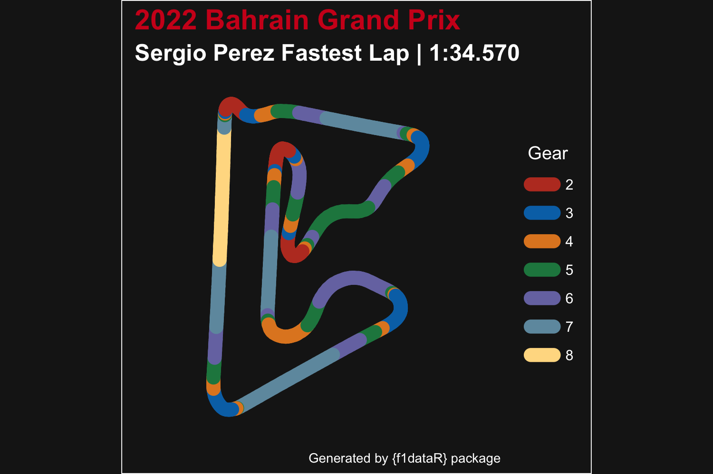

## Basics

`f1dataR` serves as a tool to get neatly organized Formula 1 data into your R environment. Here we will go over the basic functions to understand how the package works.

The most sought-after aspect of F1 data is telemetry data.
Let's get Leclerc's fastest lap from the first race of 2022:


``` r
library(f1dataR)

load_driver_telemetry(2022, 1, "Q", driver = "LEC", laps = "fastest")
#> # A tibble: 697 × 19
#>    date                session_time  time   rpm speed n_gear throttle brake   drs source       
#>    <dttm>                     <dbl> <dbl> <dbl> <dbl>  <dbl>    <dbl> <lgl> <dbl> <chr>        
#>  1 2022-03-19 15:58:18        4397. 0     10514   292      7      100 FALSE    12 interpolation
#>  2 2022-03-19 15:58:18        4397. 0.084 10502   293      7      100 FALSE    12 pos          
#>  3 2022-03-19 15:58:18        4398. 0.152 10478   294      8      100 FALSE    12 car          
#>  4 2022-03-19 15:58:18        4398. 0.384 10519   295      8      100 FALSE    12 pos          
#>  5 2022-03-19 15:58:18        4398. 0.392 10560   296      8      100 FALSE    12 car          
#>  6 2022-03-19 15:58:19        4398. 0.784 10628   297      8      100 FALSE    12 pos          
#>  7 2022-03-19 15:58:19        4398. 0.792 10696   299      8      100 FALSE    12 car          
#>  8 2022-03-19 15:58:19        4398. 0.952 10696   300      8      100 FALSE    12 car          
#>  9 2022-03-19 15:58:19        4398. 1.02  10734   301      8      100 FALSE    12 pos          
#> 10 2022-03-19 15:58:19        4399. 1.32  10773   302      8      100 FALSE    12 pos          
#> # ℹ 687 more rows
#> # ℹ 9 more variables: relative_distance <dbl>, status <chr>, x <dbl>, y <dbl>, z <dbl>,
#> #   distance <dbl>, driver_ahead <chr>, distance_to_driver_ahead <dbl>, driver_code <chr>
```

Now let's use ggplot2 to visualize some of the data we have


``` r
library(dplyr)
library(ggplot2)

lec <- load_driver_telemetry(2022, 1, "Q", driver = "LEC", laps = "fastest") %>%
  head(300)

ggplot(lec, aes(distance, throttle)) +
  geom_line() +
  theme_minimal()
```

<div class="figure">

<p class="caption">Plot of lap distance vs throttle percentage for Leclerc at the 2022 Bahrain Grand Prix Qualifying session (specifically his fastest lap)</p>
</div>

What if we get more drivers involved. Let's also get the Qualifying data from Hamilton and Pérez


``` r
ham <- load_driver_telemetry(2022, 1, "Q", driver = "HAM", laps = "fastest") %>%
  head(300)

per <- load_driver_telemetry(2022, 1, "Q", driver = "PER", laps = "fastest") %>%
  head(300)

data <- bind_rows(lec, ham, per)

ggplot(data, aes(distance, throttle, color = driver_code)) +
  geom_line() +
  theme_minimal()
```

<div class="figure">

<p class="caption">Throttle percent by distance for Leclerc, Hamilton and Perez from 2022 Bahrain Grand Prix Qualifying session</p>
</div>

## Integrated plotting

There are a couple of functions in the package that help with plotting. The first one is `theme_dark_f1()` that simply applies a theme similar to the official F1 graphics. We can apply it to our previous data.


``` r
ggplot(data, aes(distance, speed, color = driver_code)) +
  geom_line() +
  theme_dark_f1(axis_marks = TRUE) +
  theme(
    axis.title = element_text(),
    axis.line = element_line(color = "white"),
  ) +
  labs(
    title = "Speed Comparison for Bahrain 2022"
  )
```

<div class="figure">

<p class="caption">Throttle percent by distance for the three drivers, with f1dataR theme applied</p>
</div>

Another built-in function is `plot_fastest()` that can plot the speed or gear changes throughout the fastest lap for a driver/race.


``` r
plot_fastest(2022, 1, "R", "PER")
#> ℹ If the session has not been loaded yet, this could take a minute
```

<div class="figure">

<p class="caption">Fastest lap for Perez from the 2022 Bahrain Grand Prix, showing gear used at each point in the lap</p>
</div>

## Combining several functions

Now let's look at a more complete analysis. We want to visualize how lap time change over time (tyre age) for Pérez with every compound used in the Spanish GP.


``` r
laps <- load_session_laps(2023, "Spain") %>%
  filter(driver == "PER") %>%
  group_by(compound) %>%
  # Remove in and out laps
  filter(tyre_life != 1 & tyre_life != max(tyre_life)) %>%
  ungroup()

ggplot(laps, aes(tyre_life, lap_time, color = compound)) +
  geom_line() +
  geom_point() +
  theme_dark_f1(axis_marks = TRUE) +
  labs(
    color = "Tyre Compound",
    y = "Lap Time (Seconds)",
    x = "Tyre Life (Laps)"
  ) +
  scale_color_manual(
    values = c("white", "yellow", "red")
  ) +
  scale_y_continuous(breaks = seq(75, 85, 1)) +
  scale_x_continuous(breaks = seq(2, 26, 4))
```

<div class="figure">

<p class="caption">Average laptime per tyre type and age at Spanish Grand Prix 2023</p>
</div>

Now let's visualize the portion of the track where Verstappen had the throttle 100% open in the 2023 Canadian GP. Note that
we'll pass the plot through the helper function `correct_track_ratio()` to ensure the plotted track has correct dimensions (and a few other tweaks for pretty plotting). Alternatively, you can call `ggplot2::coord_fixed()` while building track plots to ensure the `x` & `y` ratios are equal.


``` r
ver_can <- load_driver_telemetry(
  season = 2023,
  round = "Canada",
  driver = "VER",
  laps = "fastest"
) %>%
  mutate(open_throttle = ifelse(throttle == 100, "Yes", "No"))

throttle_plot <- ggplot(ver_can, aes(x, y, color = as.factor(open_throttle), group = NA)) +
  geom_path(linewidth = 4, lineend = "round") +
  scale_color_manual(values = c("white", "red")) +
  theme_dark_f1() +
  labs(
    title = "Verstappen Flat Out",
    subtitle = "Canada 2023 | Fastest Lap",
    color = "Throttle 100%"
  )

correct_track_ratio(throttle_plot)
```

<div class="figure">

<p class="caption">Verstappen fastest lab in the Canadian Grand Prix 2023, showing full throttle sections</p>
</div>

For a simpler visualization let's look at the average time it took each team to pit in round 4 of 2023. For this we will have to load the pit data, the results data (to extract driver + team combos), and read the constructor data to get the colors for our plot. Note the time is the difference from pit entry to exit, not stopped time.


``` r
pit_data <- load_pitstops(2023, 4)

driver_team <- load_results(2023, 4) %>%
  select(driver_id, constructor_id)

pit_constructor <- pit_data %>%
  left_join(driver_team, by = "driver_id") %>%
  group_by(constructor_id) %>%
  summarise(pit_time = mean(as.numeric(duration)))

pit_constructor$constructor_color <- sapply(pit_constructor$constructor_id, get_team_color, season = 2023, round = 4, USE.NAMES = FALSE)

pit_constructor$team_name <- sapply(pit_constructor$constructor_id, get_team_name, season = 2023, short = TRUE, USE.NAMES = FALSE)

ggplot(pit_constructor, aes(x = team_name, y = pit_time, fill = team_name)) +
  geom_bar(stat = "identity", fill = pit_constructor$constructor_color) +
  theme_dark_f1(axis_marks = TRUE) +
  theme(
    legend.position = "none"
  ) +
  labs(
    x = "Constructor",
    y = "Average Pit Time (seconds)"
  ) +
  ggtitle("Average time in pit lane for each team", subtitle = "Azerbaijan Grand Prix 2023")
```

<div class="figure">

<p class="caption">Average time in pits for each team at the 2023 Azerbaijan Grand Prix</p>
</div>

# Help
If you're having trouble with `fastf1 is not available` errors, please check out the "Setup FastF1 Connection" vignette (`vignette("setup_fastf1", "f1dataR")`).
