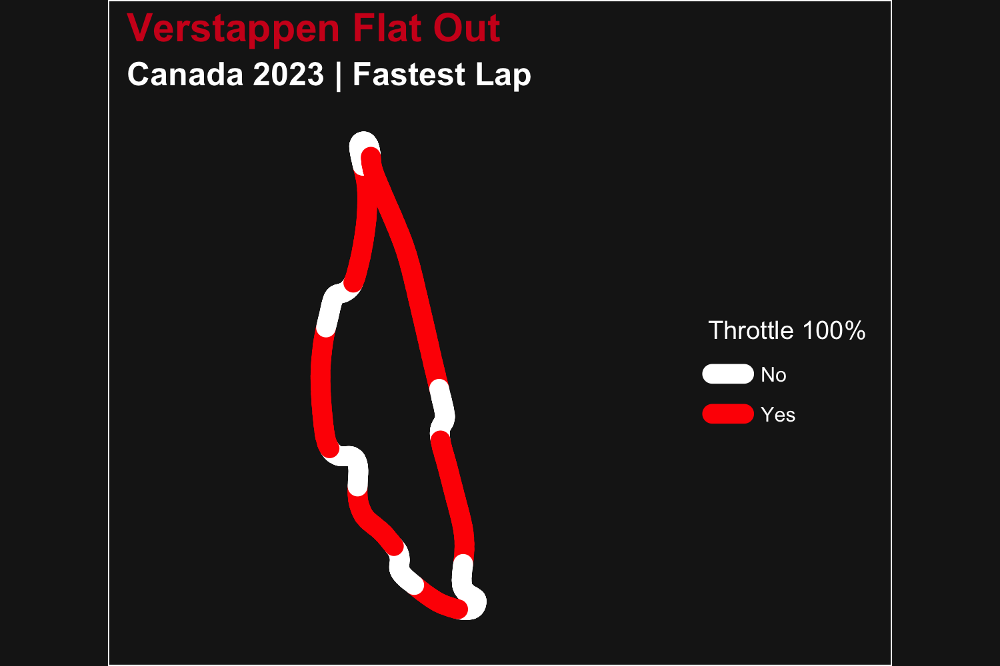

## Basics

`f1dataR` serves as a tool to get neatly organized Formula 1 data into your R environment. Here we will go over the basic functions to understand how the package works.

The most sought-after aspect of F1 data is telemetry data.
Let's get Leclerc's fastest lap from the first race of 2022:


```r
library(f1dataR)

load_driver_telemetry(2022, 1, driver = "LEC", laps = "fastest")
#> # A tibble: 706 × 19
#>    date                session_time  time   rpm speed n_gear throttle brake   drs source       
#>    <dttm>                     <dbl> <dbl> <dbl> <dbl>  <dbl>    <dbl> <lgl> <dbl> <chr>        
#>  1 2022-03-20 12:30:01        8941. 0     11301   280      7      100 FALSE     1 interpolation
#>  2 2022-03-20 12:30:01        8941. 0.063 11321   281      7      100 FALSE     1 pos          
#>  3 2022-03-20 12:30:01        8941. 0.185 11361   282      7      100 FALSE     1 car          
#>  4 2022-03-20 12:30:01        8942. 0.385 11439   284      7      100 FALSE     1 car          
#>  5 2022-03-20 12:30:01        8942. 0.463 11462   284      7      100 FALSE     1 pos          
#>  6 2022-03-20 12:30:01        8942. 0.665 11485   285      7      100 FALSE     1 car          
#>  7 2022-03-20 12:30:02        8942. 0.863 11529   286      7      100 FALSE     1 pos          
#>  8 2022-03-20 12:30:02        8942. 0.946 11574   287      7      100 FALSE     1 car          
#>  9 2022-03-20 12:30:02        8942. 1.00  11589   287      7      100 FALSE     1 pos          
#> 10 2022-03-20 12:30:02        8942. 1.15  11605   288      7      100 FALSE     1 car          
#> # ℹ 696 more rows
#> # ℹ 9 more variables: relative_distance <dbl>, status <chr>, x <dbl>, y <dbl>, z <dbl>, distance <dbl>,
#> #   driver_ahead <chr>, distance_to_driver_ahead <dbl>, driver_code <chr>
```

Now let's use ggplot2 to visualize some of the data we have


```r
library(dplyr)
library(ggplot2)

lec <- load_driver_telemetry(2022, 1, driver = "LEC", laps = "fastest") %>%
  head(300)

ggplot(lec, aes(distance, throttle)) +
  geom_line() +
  theme_minimal()
```

<div class="figure">

<p class="caption">plot of chunk simple_plot</p>
</div>

What if we get more drivers involved. Let's also get the Qualifying data from Hamilton and Pérez


```r
ham <- load_driver_telemetry(2022, 1, "Q", driver = "HAM", laps = "fastest") %>%
  head(300)

per <- load_driver_telemetry(2022, 1, driver = "PER", laps = "fastest") %>%
  head(300)

data <- bind_rows(lec, ham, per)

ggplot(data, aes(distance, throttle, color = driver_code)) +
  geom_line() +
  theme_minimal()
```

<div class="figure">

<p class="caption">plot of chunk triple_plot</p>
</div>

## Integrated plotting

There are a couple of functions in the package that help with plotting. The first one is `theme_dark_f1()` that simply applies a theme similar to the official F1 graphics. We can apply it to our previous data.


```r
ggplot(data, aes(distance, speed, color = driver_code)) +
  geom_line() +
  theme_dark_f1() +
  theme(
    axis.title = element_text(),
    axis.line = element_line(color = "white"),
  ) +
  labs(
    title = "Speed Comparison for Bahrain 2022"
  )
```

<div class="figure">

<p class="caption">plot of chunk use_theme</p>
</div>

Another built-in function is `plot_fastest()` that can plot the speed or gear changes throughout the fastest lap for a driver/race.


```r
plot_fastest(2022, 1, "R", "PER")
#> ℹ If the session has not been loaded yet, this could take a minute
```

<div class="figure">

<p class="caption">plot of chunk use_builtin</p>
</div>

## Combining several functions

Now let's look at a more complete analysis. We want to visualize how lap time change over time (tyre age) for Pérez with every compound used in the Spanish GP.


```r
laps <- load_session_laps(2023, "Spain") %>%
  filter(driver == "PER") %>%
  group_by(compound) %>%
  # Remove in and out laps
  filter(tyre_life != 1 & tyre_life != max(tyre_life)) %>%
  ungroup()

ggplot(laps, aes(tyre_life, lap_time, color = compound)) +
  geom_line() +
  geom_point() +
  theme_dark_f1(axis_marks = TRUE) +
  labs(
    color = "Tyre Compound",
    y = "Lap Time (Seconds)",
    x = "Tyre Life (Laps)"
  ) +
  scale_color_manual(
    values = c("white", "yellow", "red")
  ) +
  scale_y_continuous(breaks = seq(75, 85, 1)) +
  scale_x_continuous(breaks = seq(2, 26, 4))
```

<div class="figure">

<p class="caption">plot of chunk session_laps</p>
</div>

Now let's visualize the portion of the track where Verstappen had the throttle 100% open in the 2023 Canadian GP.


```r
ver_can <- load_driver_telemetry(
  season = 2023,
  round = "Canada",
  driver = "VER",
  laps = "fastest"
) %>%
  mutate(open_throttle = ifelse(throttle == 100, "Yes", "No"))

ggplot(ver_can, aes(x, y, color = as.factor(open_throttle), group = NA)) +
  geom_path(linewidth = 4, lineend = "round") +
  scale_color_manual(values = c("white", "red")) +
  theme_dark_f1() +
  labs(
    title = "Verstappen Flat Out",
    subtitle = "Canada 2023 | Fastest Lap",
    color = "Throttle 100%"
  )
```

<div class="figure">

<p class="caption">plot of chunk telem_plotting</p>
</div>

For a simpler visualization let's look at the average time it took each team to pit in round 4 of 2023. For this we will have to load the pit data, the results data (to extract driver + team combos), and the constructor data to get the colors for our plot.


```r
pit_data <- load_pitstops(2023, 4)

driver_team <- load_results(2023, 4) %>%
  select(driver_id, constructor_id)

constructors <- constructor_data %>%
  select(constructor_id, constructor_color) %>%
  unique()

pit_constructor <- pit_data %>%
  left_join(driver_team, by = "driver_id") %>%
  group_by(constructor_id) %>%
  summarise(pit_time = mean(as.numeric(duration))) %>%
  left_join(constructors, by = "constructor_id")


ggplot(pit_constructor, aes(x = constructor_id, y = pit_time, fill = constructor_id)) +
  geom_bar(stat = "identity", fill = pit_constructor$constructor_color) +
  theme_dark_f1(axis_marks = TRUE) +
  theme(
    legend.position = "none"
  ) +
  labs(
    x = "Constructor",
    y = "Average Pit Time (seconds)"
  )
```

<div class="figure">

<p class="caption">plot of chunk pitstop</p>
</div>

# Help
If you're having trouble with `fastf1 is not available` errors, please check out the "Setup FastF1 Connection" vignette (`vignette("setup_fastf1", "f1dataR")`).
