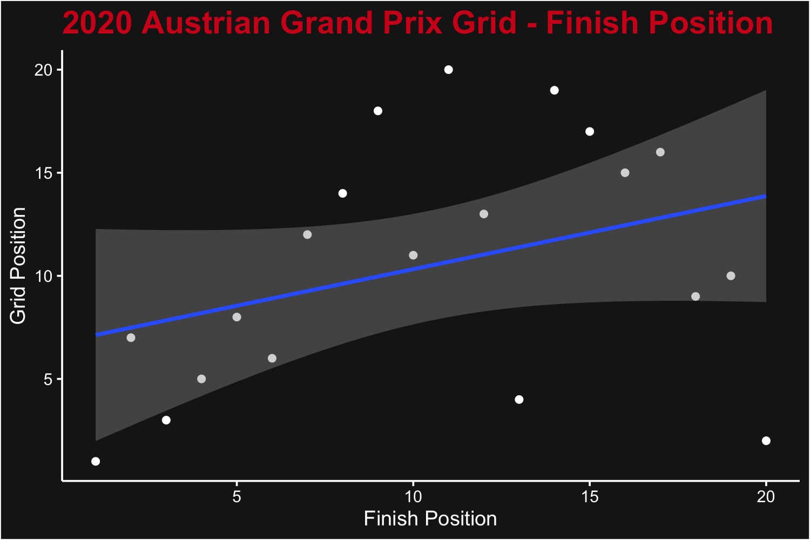
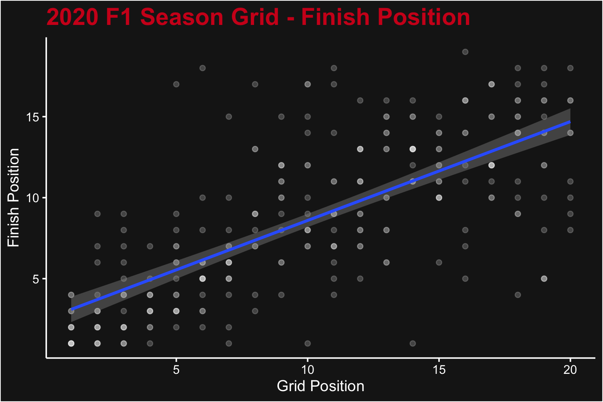
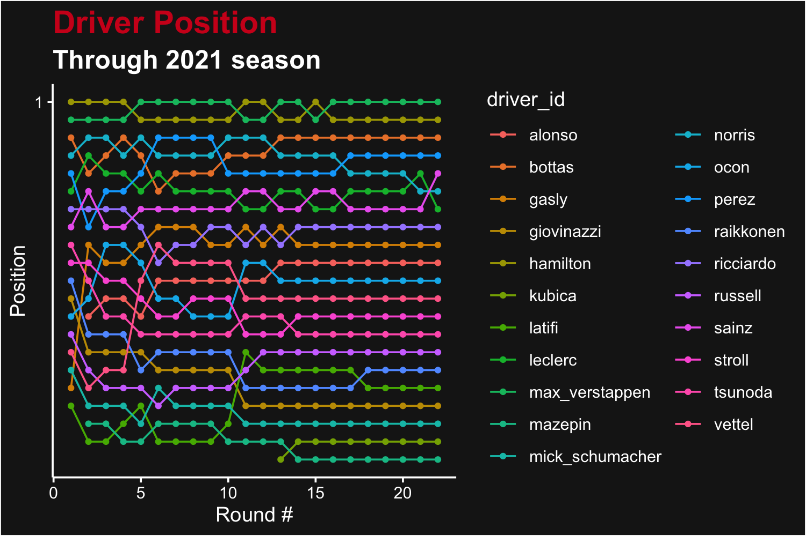
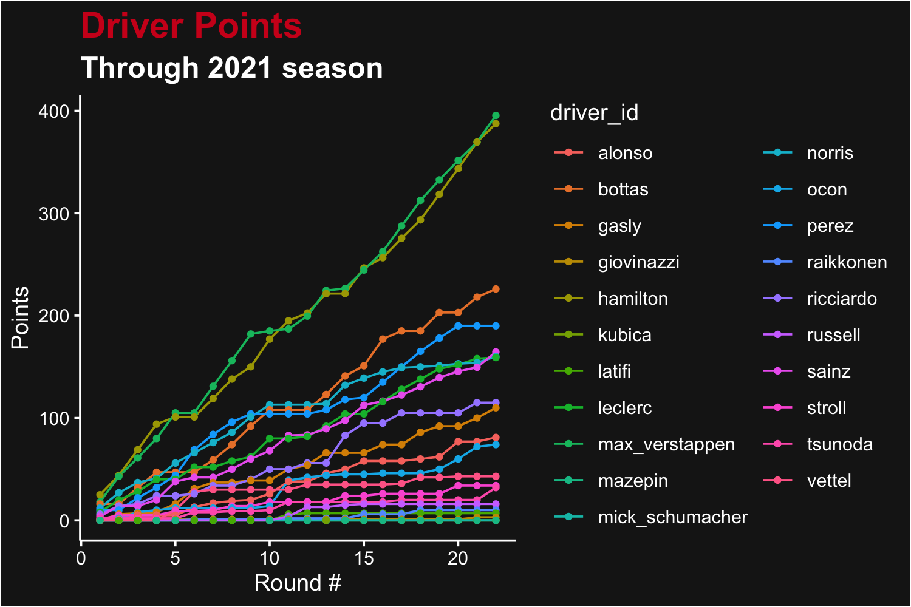
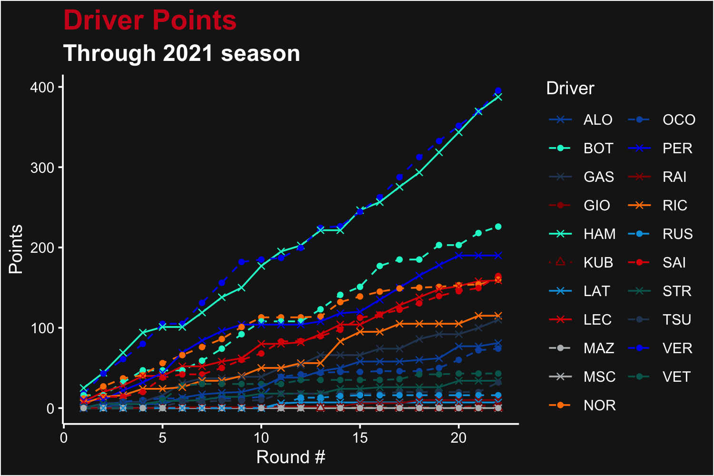
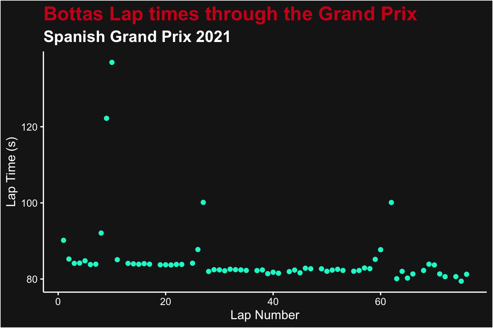
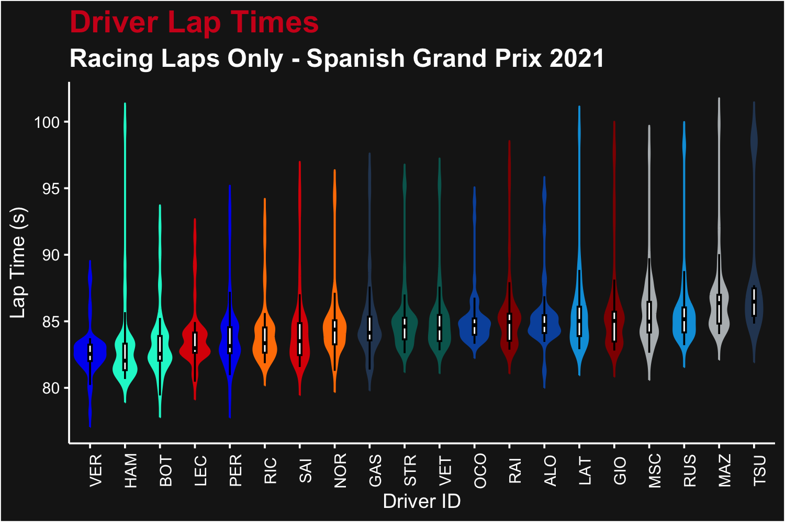
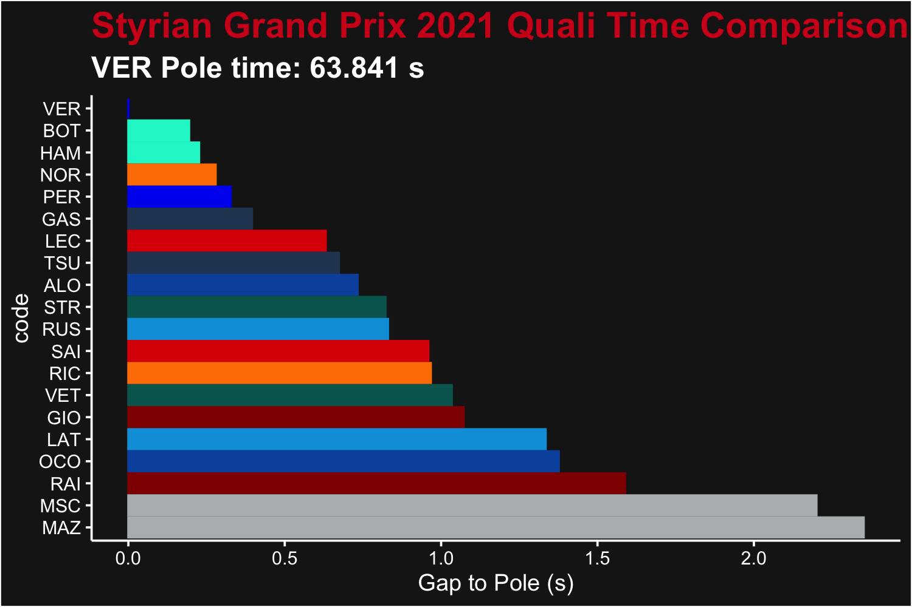

# Introduction

This vignette provides a few demonstrations of possible data analysis projects using `f1dataR` and the data pulled from the [Jolpica API](https://api.jolpi.ca/). All of the data used comes from Jolpica and is not supplied by Formula 1. However, this data source is incredibly useful for accessing a host of data.

This package (and vignette) previously used the Ergast Motor Racing Database. Unfortunately, Ergast was shuttered in 2024. Jolpica was developed as a direct replacement.

We'll load all the required libraries for our data analysis:


``` r
library(f1dataR)
library(dplyr)
```

# Sample Data Analysis
Here are a few simple data analysis examples using Jolpica's data.

 > Note that, when downloading multiple sets of data, we'll put a short `Sys.sleep()` in the loop to reduce load on their servers. Please be a courteous user of their free service and have similar pauses built into your analysis code. Please read their [Terms and Conditions](https://github.com/jolpica/jolpica-f1/blob/main/docs/rate_limits.md) for more information.

We can make multiple repeat calls to the same function (with the same arguments) as the `f1dataR` package automatically caches responses from Jolpica. You'll see this taken advantage of in a few areas.

If you have example projects you want to share, please feel free to submit them as an issue or pull request to the `f1dataR` [repository on Github](https://github.com/scasanova/f1dataR).

## Grid to Finish Position Correlation

We can look at the correlation between the starting (grid) position and the race finishing position. We'll look at the Austrian Grand Prix from 2020 for this analysis, not because of any particular reason, but that it produced a well mixed field.


``` r
library(ggplot2)
# Load the data
results <- load_results(2020, 1) %>%
  mutate(
    grid = as.numeric(grid),
    position = as.numeric(position)
  )

ggplot(results, aes(x = position, y = grid)) +
  geom_point(color = "white") +
  stat_smooth(method = "lm") +
  theme_dark_f1(axis_marks = TRUE) +
  ggtitle("2020 Austrian Grand Prix Grid - Finish Position") +
  xlab("Finish Position") +
  ylab("Grid Position")
```

<div class="figure">

<p class="caption">A plot of grid position (y axis) vs race finishing position (x axis) for the 2020 Austrian Grand Prix</p>
</div>

Of course, this isn't really an interesting plot for a single race. Naturally we expect that a better grid position yields a better finish position, but there's so much variation in one race (including the effect of DNF) that it's a very weak correlation. We can look at the whole season instead by downloading sequentially the list of results. We'll filter the results to remove those who didn't finish the race, and also those who didn't start from the grid (i.e. those who started from Pit Lane, where `grid` = 0).


``` r
# Load the data
results <- data.frame()
for (i in seq_len(17)) {
  Sys.sleep(1)
  r <- load_results(2022, i)
  results <- dplyr::bind_rows(results, r)
}

results <- results %>%
  mutate(
    grid = as.numeric(grid),
    position = as.numeric(position)
  ) %>%
  filter(status %in% c("Finished", "+1 Lap", "+2 Laps", "+6 Laps"), grid > 0)

ggplot(results, aes(y = position, x = grid)) +
  geom_point(color = "white", alpha = 0.2) +
  stat_smooth(method = "lm") +
  theme_dark_f1(axis_marks = TRUE) +
  ggtitle("2020 F1 Season Grid - Finish Position") +
  ylab("Finish Position") +
  xlab("Grid Position")
```

<div class="figure">

<p class="caption">A plot of grid position (y axis) vs race finishing position (x axis) for all 2020 Grands Prix</p>
</div>

As expected, this produces a much stronger signal confirming our earlier hypothesis.


## Driver Points Progress

Jolpica contains the points for drivers' or constructors' championship races as of the end of every round in a season. We can pull a season's worth of data and compare the driver pace throughout the season, looking at both position or total points accumulation. We'll do that for 2021, which had good competition throughout the year for P1.


``` r
# Load the data
points <- data.frame()
for (rnd in seq_len(22)) {
  p <- load_standings(season = 2021, round = rnd) %>%
    mutate(round = rnd)
  points <- rbind(points, p)
  Sys.sleep(1)
}

points <- points %>%
  mutate(
    position = as.numeric(position),
    points = as.numeric(points)
  )

# Plot the Results
ggplot(points, aes(x = round, y = position, color = driver_id)) +
  geom_line() +
  geom_point(size = 1) +
  ggtitle("Driver Position", subtitle = "Through 2021 season") +
  xlab("Round #") +
  ylab("Position") +
  scale_y_reverse(breaks = seq_along(length(unique(points$position)))) +
  theme_dark_f1(axis_marks = TRUE)
#> Warning: Removed 2 rows containing missing values or values outside the scale range (`geom_line()`).
#> Warning: Removed 2 rows containing missing values or values outside the scale range
#> (`geom_point()`).
```

<div class="figure">

<p class="caption">Driver ranking after each Grand Prix of the 2021 season</p>
</div>

What may be more interesting is the total accumulation of points. For that we can change up the plot just a little bit.


``` r
# Plot the Results
ggplot(points, aes(x = round, y = points, color = driver_id)) +
  geom_line() +
  geom_point(size = 1) +
  ggtitle("Driver Points", subtitle = "Through 2021 season") +
  xlab("Round #") +
  ylab("Points") +
  theme_dark_f1(axis_marks = TRUE)
```

<div class="figure">

<p class="caption">Total points for each driver after each Grand Prix in the 2021 season</p>
</div>


Both of these are a bit hard to read and use `driver_id` values that aren't pretty on the plot. We can use some of the FastF1 look-up functions to improve our graphics (recalling that Kubica raced for Alfa Romeo for races 13 & 14 mid-season). We'll first build a data.frame of all drivers and styles for the season, and join that to the points data.frame after we generate driver abbreviations from the Jolpica `driver_id`.


``` r
driver_style <- rbind(
  get_session_drivers_and_teams(2021, round = 1),
  get_session_drivers_and_teams(2021, round = 13)
) %>%
  unique()

driver_style$linestyle <- driver_style$marker <- driver_style$color <- driver_style$abbreviation <- NA

for (i in seq_along(driver_style$name)) {
  if (driver_style$name[i] == "Robert Kubica") {
    # Manually handling Kubica
    style <- get_driver_style(driver_style$name[i], season = 2021, round = 13)
    driver_style$color[i] <- style$color
    driver_style$marker[i] <- 2
    driver_style$linestyle[i] <- "dotted"
    driver_style$abbreviation[i] <- style$abbreviation
  } else {
    style <- get_driver_style(driver_style$name[i], season = 2021, round = 1)
    driver_style$color[i] <- style$color
    driver_style$marker[i] <- style$marker
    driver_style$linestyle[i] <- style$linestyle
    driver_style$abbreviation[i] <- style$abbreviation
  }
}

color_values <- driver_style$color
names(color_values) <- driver_style$abbreviation

marker_values <- driver_style$marker
names(marker_values) <- driver_style$abbreviation

linestyle_values <- driver_style$linestyle
names(linestyle_values) <- driver_style$abbreviation

points <- dplyr::left_join(points, load_drivers(2021)[, c("driver_id", "code")], by = "driver_id")
```

With our data having graphical and label information added, we can remake these plots:

``` r
ggplot(points, aes(x = round, y = points, color = code, shape = code, linetype = code)) +
  geom_line() +
  geom_point() +
  scale_color_manual(name = "Driver", values = color_values, aesthetics = c("color", "fill")) +
  scale_shape_manual(name = "Driver", values = marker_values) +
  scale_linetype_manual(name = "Driver", values = linestyle_values) +
  ggtitle("Driver Points", subtitle = "Through 2021 season") +
  xlab("Round #") +
  ylab("Points") +
  theme_dark_f1(axis_marks = TRUE)
```

<div class="figure">

<p class="caption">Remade points plot for each driver after each Grand Prix in the 2021 season, with better driver names and colors</p>
</div>

## Driver Lap Time Scatter Plot

We can look at a scatterplot of a driver's laptimes throughout a race - possibly observing the effect of fuel usage, tire wear, pit stops, and race conditions. We'll also show extracting constructor colour from the built-in data set.


``` r
# Load the laps data and select one driver (this time - Russell)
bot <- load_laps(season = 2021, round = 4) %>%
  filter(driver_id == "bottas")

# Get Grand Prix Name
racename <- load_schedule(2021) %>%
  filter(round == 4) %>%
  pull("race_name")

racename <- paste(racename, "2021")

# Plot the results
ggplot(bot, aes(x = lap, y = time_sec)) +
  geom_point(color = get_driver_color("Bottas", 2021, 4)) +
  theme_dark_f1(axis_marks = TRUE) +
  ggtitle("Bottas Lap times through the Grand Prix", subtitle = racename) +
  xlab("Lap Number") +
  ylab("Lap Time (s)")
```

<div class="figure">

<p class="caption">Laptimes for George Russell, for each lap from the 2021 Spanish Grand Prix</p>
</div>

We can see the most of Bottas' laps were less than 90 seconds. Note a safety car had occurred around lap 8.

With the above data, we can also visualize all driver's laptimes with violin plots. We'll trim the laptimes to exclude anything above 100 seconds to make the variation in lap time easier to see (i.e. show only racing laps). We can recycle the color values we produced above.


``` r
# Load the laps data (cached!) and filter
laps <- load_laps(season = 2021, round = 4) %>%
  filter(time_sec < 100) %>%
  group_by(driver_id) %>%
  mutate(driver_avg = mean(time_sec)) %>%
  ungroup() %>%
  left_join(load_drivers(2021)[, c("driver_id", "code")], by = "driver_id") %>%
  mutate(code = factor(code, unique(code[order(driver_avg)])))

ggplot(laps, aes(x = code, y = time_sec, color = code, fill = code)) +
  geom_violin(trim = FALSE) +
  scale_color_manual("Driver", values = color_values, aesthetics = c("color", "fill")) +
  geom_boxplot(width = 0.1, color = "black", fill = "white", outlier.shape = NA) +
  theme_dark_f1(axis_marks = TRUE) +
  ggtitle("Driver Lap Times", subtitle = paste("Racing Laps Only -", racename)) +
  xlab("Driver ID") +
  ylab("Lap Time (s)") +
  theme(axis.text.x = element_text(angle = 90), legend.position = "")
```

<div class="figure">

<p class="caption">Laptime distributions for all drivers from the 2021 Spanish Grand Prix (racing laps only)</p>
</div>


## Compare Qualifying Times

We can compare the qualifying times for all drivers from a Grand Prix. There's naturally a few ways to do this (pick each driver's fastest time, pick each driver's fastest time from the last session they participated in, etc), all with pros or cons. Rerunning this analysis with different ways of handling the data could produce different results!


``` r
# Load the Data
quali <- load_quali(2021, 8)

# Get Grand Prix Name
racename <- load_schedule(2021) %>%
  filter(round == 8) %>%
  pull("race_name")

# Process the Data
quali <- quali %>%
  summarize(t_min = min(q1_sec, q2_sec, q3_sec, na.rm = TRUE), .by = driver_id) %>%
  mutate(t_diff = t_min - min(t_min)) %>%
  left_join(load_drivers(2021)[, c("driver_id", "code")], by = "driver_id") %>%
  mutate(code = factor(code, unique(code[order(-t_min)])))

# Plot the results
ggplot(quali, aes(x = code, y = t_diff, color = code, fill = code)) +
  geom_col() +
  coord_flip() +
  ggtitle(paste0(racename, " 2021 Quali Time Comparison"),
    subtitle = paste("VER Pole time:", min(quali$t_min), "s")
  ) +
  scale_color_manual(values = color_values, aesthetics = c("fill", "color")) +
  ylab("Gap to Pole (s)") +
  theme_dark_f1(axis_marks = TRUE) +
  theme(legend.position = "")
```

<div class="figure">

<p class="caption">Gap to Pole at the end of qualifying for the 2021 Styrian Grand Prix</p>
</div>
